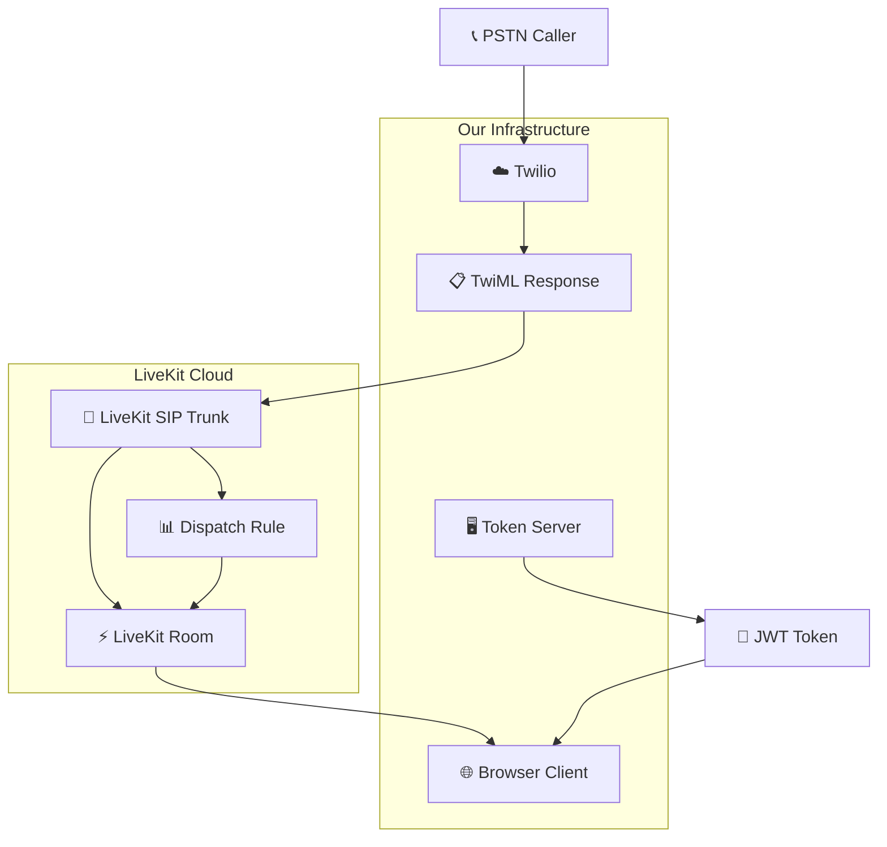

# PSTN-to-Browser Communication System

A production-grade web application that connects incoming PSTN calls (regular phone calls) to browser clients using **Twilio + LiveKit**. Built with React, TypeScript, Node.js, and WebRTC for real-time audio communication.

## 🏗️ Architecture Overview



## 🚀 Quick Start

### Prerequisites
- Node.js 18+ and npm
- Docker & Docker Compose (recommended)
- Twilio account with phone number
- LiveKit Cloud account

### 1. Environment Setup

```bash
# Copy environment template
cp config/.env.example config/.env

# Edit config/.env with your credentials:
# - LIVEKIT_API_KEY, LIVEKIT_API_SECRET, LIVEKIT_WS_URL
# - TWILIO_ACCOUNT_SID, TWILIO_AUTH_TOKEN, TWILIO_PHONE_NUMBER
# - LIVEKIT_SIP_DOMAIN, LIVEKIT_SIP_TRUNK_NUMBER
```

### 2. Docker Deployment (Recommended)

```bash
# Start all services
docker-compose up -d

# View logs
docker-compose logs -f

# Stop services
docker-compose down
```

### 3. Manual Development Setup

```bash
# Install dependencies
npm install
cd server && npm install && cd ..

# Start server (Terminal 1)
cd server && npm run dev

# Start client (Terminal 2)
npm run dev

# Run tests
cd server && npm test
```

## 📋 Call Flow

1. **PSTN Call Initiation**: Caller dials your Twilio number
2. **TwiML Processing**: Twilio webhook generates TwiML with `<Dial><Sip>` 
3. **SIP Forwarding**: Call routes to LiveKit SIP trunk via UDP
4. **Room Creation**: LiveKit dispatch rule assigns caller to room
5. **Browser Connection**: Web client gets JWT token and joins room
6. **Audio Bridge**: Two-way WebRTC audio between phone and browser

## 🎯 Key Features

- **Real-time Audio**: Low-latency PSTN-to-WebRTC bridging
- **Auto-hangup**: Calls end after 10 seconds of silence
- **Call Status**: Live duration, participant count, connection state
- **Professional UI**: Clean call center-style interface
- **Production Ready**: Docker deployment, comprehensive tests
- **Monitoring**: Health checks, structured logging

## 🧪 Testing

```bash
cd server

# Run all tests
npm test

# Run with coverage
npm run test -- --coverage

# Watch mode
npm run test:watch
```

**Test Coverage:**
- ✅ Token generation and JWT validation
- ✅ Silence detection and auto-hangup logic  
- ✅ SIP call routing and TwiML generation
- ✅ Integration tests for API endpoints

## 📁 Project Structure

```
├── src/                    # React client application
│   ├── components/         # UI components
│   │   └── CallInterface.tsx
│   ├── pages/             # Route pages
│   └── hooks/             # Custom React hooks
├── server/                # Node.js backend
│   ├── src/
│   │   ├── server.ts      # Express server
│   │   ├── livekit-setup.ts
│   │   └── tests/         # Unit & integration tests
│   └── package.json
├── config/                # Configuration files
│   ├── .env.example       # Environment template
│   ├── dispatch-rules.json
│   └── twiml/
└── docker-compose.yml     # Multi-service deployment
```

## 🔧 Configuration

### Twilio Setup
1. Purchase a phone number in Twilio Console
2. Configure webhook URL: `https://your-domain.com/api/twilio/webhook`
3. Set webhook method to `POST`

### LiveKit Setup
1. Create project in LiveKit Cloud
2. Generate API key and secret
3. Note your WebSocket URL
4. Configure SIP domain for trunk

### SIP Trunk Configuration
```json
{
  "sipTrunkId": "twilio-pstn-trunk",
  "inboundAddresses": [
    "54.172.60.0/30",    // Twilio IP ranges
    "54.244.51.0/30"
  ],
  "transport": "udp"
}
```

## 🌐 API Endpoints

- `POST /api/token` - Generate LiveKit access tokens
- `POST /api/twilio/webhook` - Handle incoming call TwiML
- `POST /api/sip/setup` - Configure SIP trunk and dispatch rules
- `GET /health` - Service health check

## 🔊 Edge Features

### Silence Detection
- Monitors audio activity in real-time
- Auto-ends calls after 10 seconds of silence
- Configurable timeout threshold
- Logs silence events for analytics

### Call Controls
- 🎤 Mute/unmute microphone
- 🔊 Enable/disable audio output  
- 📞 Manual call termination
- ⏱️ Live call duration display

## 🐳 Production Deployment

### Docker Production Stack
```bash
# Production build with Nginx
docker-compose --profile production up -d

# Scale services
docker-compose up -d --scale server=3
```

### Environment Variables
```bash
# Required for production
LIVEKIT_API_KEY=your_production_key
LIVEKIT_API_SECRET=your_production_secret
LIVEKIT_WS_URL=wss://your-project.livekit.cloud
TWILIO_ACCOUNT_SID=your_account_sid
TWILIO_AUTH_TOKEN=your_auth_token

# Optional
PORT=3001
NODE_ENV=production
CLIENT_URL=https://your-domain.com
```

## 🔍 Monitoring & Logs

```bash
# View server logs
docker-compose logs -f server

# Monitor call events
curl http://localhost:3001/health

# Check connection status
curl http://localhost:3001/api/call/status
```

## 🔧 Development

### Adding Custom Features
```typescript
// Extend CallInterface component
const handleCustomEvent = (data: any) => {
  // Your custom logic
  toast({
    title: "Custom Event",
    description: "Handle your specific use case"
  });
};
```

### Custom TwiML Rules
```xml
<!-- config/twiml/custom-routing.xml -->
<Response>
  <Dial>
    <Sip>sip:{{TRUNK}}@{{DOMAIN}}?CustomParam={{VALUE}}</Sip>
  </Dial>
</Response>
```

## 🏗️ Assumptions Made

1. **Network**: Stable internet connection for WebRTC
2. **Browsers**: Modern browsers with WebRTC support
3. **Twilio**: SIP-compatible phone number and account
4. **LiveKit**: Cloud account with SIP trunk capability
5. **Security**: HTTPS required for WebRTC in production
6. **Audio**: Microphone permissions granted by users

## ⚡ Future Improvements

With more time, I would enhance:

- **Video Support**: Add video calling capability
- **Call Recording**: Store calls for compliance/training
- **Advanced Routing**: Smart dispatch based on caller attributes  
- **Analytics Dashboard**: Call metrics, quality scores, usage stats
- **Multi-tenant**: Support multiple organizations
- **Mobile Apps**: Native iOS/Android clients
- **Load Balancing**: Horizontal scaling for high call volumes
- **WebSocket Fallback**: Alternative transport for restrictive networks
- **Call Queuing**: Hold music and queue management
- **Integration APIs**: CRM webhooks, Slack notifications

## 📞 Usage Examples

### Basic Call Flow
```bash
# 1. Start the system
docker-compose up -d

# 2. Open browser to http://localhost:8080

# 3. Call your Twilio number from any phone

# 4. Browser automatically connects to the call
```

### Manual Room Join
```bash
# Join specific room in browser interface
Room: call-12345
Click "Join Call"
```

## 🛠️ Technologies Used

- **Frontend**: React 18, TypeScript, Tailwind CSS, shadcn/ui
- **Backend**: Node.js, Express, LiveKit Server SDK
- **Real-time**: LiveKit WebRTC, SIP Protocol
- **Telephony**: Twilio Voice, TwiML
- **Testing**: Jest, Supertest
- **Deployment**: Docker, Docker Compose, Nginx
- **Build**: Vite, TypeScript Compiler

## 📝 License

MIT License - see LICENSE file for details.

## 🤝 Contributing

1. Fork the repository
2. Create feature branch (`git checkout -b feature/amazing-feature`)
3. Commit changes (`git commit -m 'Add amazing feature'`)
4. Push to branch (`git push origin feature/amazing-feature`)
5. Open Pull Request

---

Built with ❤️ for seamless PSTN-to-browser communication.
